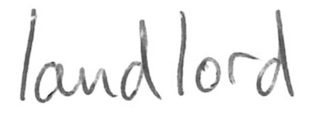

# Synthetic Strikethrough Generation

This package generates synthetic strikethrough and applies it to a given word image. Strikethrough strokes are generated based on image statistics.

To get started, install the required packages (cf. [requirements.txt](requirements.txt)) and run [example.py](example.py).

### Generation Example
Input|Output
---|---
|
## License
MIT License, see [LICENSE](LICENSE) for details.

## Citation
If you find this work useful, please consider citing this repository or the related paper:
```
@INPROCEEDINGS{heil2021strikethrough,
  author={Heil, Raphaela and Vats, Ekta and Hast, Anders},
  booktitle={2021 International Conference on Document Analysis and Recognition (ICDAR)},
  title={{Strikethrough Removal from Handwritten Words Using CycleGANs}},
  year={2021},
  pubstate={to appear}}
```
