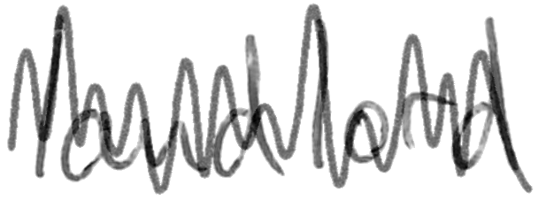

# Synthetic Strikethrough Generation  

[](https://doi.org/10.5281/zenodo.4767063)


This package generates synthetic strikethrough and applies it to a given word image. Strikethrough strokes are generated based on image statistics.

To get started, install the required packages (cf. [requirements.txt](requirements.txt)) and run [example.py](example.py).

### Generation Example
Input|Output
---|---
|
## License
MIT License, see [LICENSE](LICENSE) for details.

## Citation
If you find this work useful, please consider citing this repository or the related paper:

```
@article{raphaela heil_2021,
title={RaphaelaHeil/strikethrough-generation: Release for publication},
DOI={10.5281/zenodo.4767063},
publisher={Zenodo},
author={Raphaela Heil},
year={2021},
month={May}}
```
```
@InProceedings{10.1007/978-3-030-86337-1_38,
author="Heil, Raphaela
and Vats, Ekta
and Hast, Anders",
editor="Llad{\'o}s, Josep
and Lopresti, Daniel
and Uchida, Seiichi",
title="Strikethrough Removal from Handwritten Words Using CycleGANs",
booktitle="Document Analysis and Recognition -- ICDAR 2021",
year="2021",
publisher="Springer International Publishing",
address="Cham",
pages="572--586",
}
```
